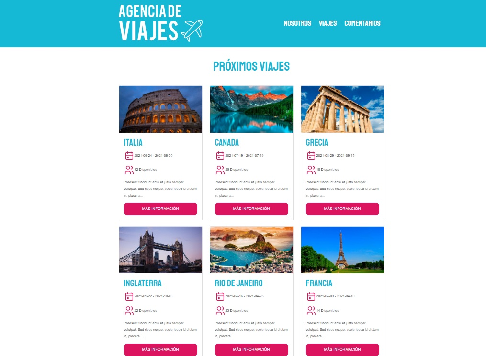

# agenciaViajesNode
Proyecto Agencia de Viajes realizado con Node, Sequelize, Mysql

## Objetivo
+ Conexión Render
+ Subir Base de Datos 
+ Deploy en Render
+ Validar Formulario

### Visita el proyecto.

[Visita el proyecto](https://agencia-viajes-node-p2ya.onrender.com)

## Lenguajes
+ JavaScript
+ Nodejs+
+ Pug
